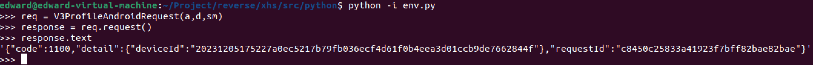

# reverse

案例仅学习交流

## 完成接口
- `http://fp-it.fengkongcloud.com/v3/cloudconf`
- `http://fp-it.fengkongcloud.com/v3/profile/android`

## 使用案例

- 进入`xxx/src/python`路径
- 启动python交互环境: `python -i env.py`
- 交互环境中使用如下方式发起请求
  ```python
  # 创建请求
  req = V3ProfileAndroidRequest(a,d,sm)
  # 发起请求
  response = req.request()
  # 获得请求内容
  response.text
  ```
- 结果
  
